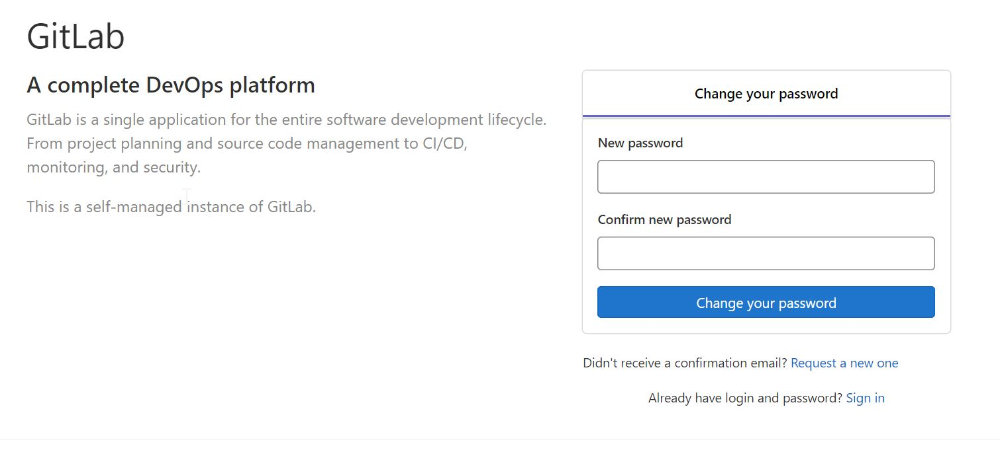

# **Install Gitlab Service**

## **Architecture**


This is the simple architecture to install the GitLab Service using the Docker engine as per the below.
  * In the Linux Virtual machine, installed a Docker engine to create the containers. 
  * Pulling the GitLab Image from the docker registry. 
  * Creating the persistent volumes using the host volume. 


## **Prerequistes**

* Docker
* Docker Compose

## **Installation**

### **Installation Method**

we can install the GitLab service in two different ways based on the requirement.
1.	Install the GitLab service (HTTP) – Only for Testing
2.	Install the GitLab service (HTTPS) - Production

### 1. Install the GitLab service (HTTP) 


* Clone the repo in your machine.

```
git clone https://github.com/vstharani8/gitlab.git
```
* Setup the volume location for the Data and Logs

  1. Create the directory where you want to store the data for the GitLab.
  2. Configure a new environment variable $GITLAB_HOME pointing to the directory
      ```
      export GITLAB_HOME=/opt/gitlab
      ```
  3. If you don't want to use environment variable, replace the $GITLAB_HOME with your directory in the docker-compose.yml (volumes) (Eg:  '/opt/gitlab/config:/etc/gitlab')
* Go to that folder where you clone the repo. Make sure docker-compose.yml file exists in the folder and run the below command to install the GitLab service as a container.
    ```
    docker-compose up -d
    ```
* Check the container status using the below command
    ```
    docker-compose ps 
    ```
* The initialization process will take time and you can track the progress with the below command
    ```
     docker logs -f container_name
    ```
* After that, browse the web page using your IP address
    ```
     http://IP_Address
    ```
* When you log in to GitLab first time, will ask to set the admin password. After you change, you can login with your username (root) and password



### 2. Install the GitLab service (HTTPS)

* Clone the repo and setup the volume location as the above mentioned

* For this installation, we need to have a domain name and certifiactes before proceeding. Once have, do the below steps.

    1.	Change the domain name in the /HTTPS/docker-compose.yml file. (Eg. gitlab.example.com)
    2.	Create the SSL directory in the $GITHUB_HOME as per the below

        ```
        mkdir $GITLAB_HOME/config/ssl
        ```
    3.  Copy your certificate and key files to the ssl folder (Eg. gitlab.example.com.crt, gitlab.example.com.key). 
    4.  It should be with your domain name

* Run the docker-compose command to install the GitLab service from the HTTPS directory
    ```
    docker-compose up -d
    ```
* Check the container status using the below command
    ```
    docker-compose ps 
    ```
*  The initialization process will take time and you can track the progress with the below command
    ```
     docker logs -f container_name
    ```
* After that, browse the web page using your domain name
    ```
     https://domain_name
    ```
* When you log in to GitLab first time, will ask to set the admin password. After you change, you can login with your username (root) and password